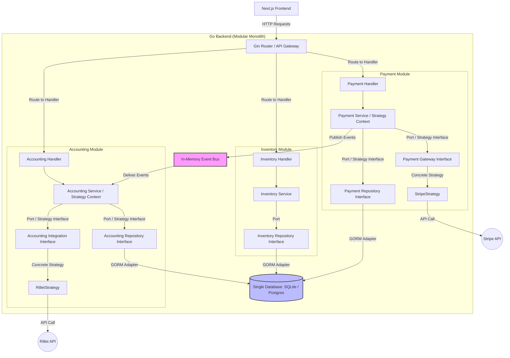

# Design Document: Modular Monolith with Go & Next.js

This document outlines the architectural design, directory structure, data patterns, integration layers, and testing strategies for the Modular Monolith integrating **Inventory Management**, **Payment Management**, and **Accounting Integrations**.

## 1. Architectural Patterns

### Hexagonal Architecture (Ports and Adapters)
We use Hexagonal Architecture to isolate core business logic from external vendors (e.g., Stripe for payments, Rillet for accounting).
* **Ports (Interfaces)**: Boundary interfaces defined inside the domain layers (e.g., `PaymentGateway`, `AccountingIntegration`).
* **Adapters / Concrete Strategies**: Concrete classes/structs that implement the Port interfaces by translating domain commands into vendor-specific API calls (e.g., `StripeStrategy`, `RilletStrategy`).

### Strategy Pattern & Strategy Context
The **Strategy Pattern** works hand-in-hand with our **Ports and Adapters**:
* **Strategy Interface**: The domain **Port** (e.g., `PaymentGateway`) acts as the Strategy interface.
* **Concrete Strategies**: The vendor strategies (e.g., `StripeStrategy`, `PayPalStrategy`, `RilletStrategy`) implement the strategy interface.
* **Strategy Context**: The Domain Service (e.g., `PaymentService`) acts as the **Strategy Context**. At runtime, it dynamically receives or selects the appropriate concrete **Strategy** (such as `StripeStrategy`) based on context parameters (such as customer preference or request metadata) and delegates execution to it.

#### Defense of Strategy Pattern over Static Adapter:
* **Dynamic Runtime Switching**: A simple Adapter pattern is often bound statically at startup (e.g., "the entire system uses Stripe"). The Strategy Pattern explicitly enables **runtime flexibility**—allowing the application to switch payment or accounting implementations per request, per merchant/tenant, or based on regional routing rules.
* **Encapsulated Behavioral Variation**: Strategy treats external vendor integrations as interchangeable behavioral strategies rather than fixed structural wrappers, keeping the business domain completely agnostic of vendor logic.
* **Extensibility Without Refactoring**: Adding a new integration (e.g., `PayPalStrategy` or `QuickBooksStrategy`) requires zero modifications to the `PaymentService` or `AccountingService` (Strategy Context), strictly adhering to the Open/Closed Principle.



### Domain Events / Publisher-Subscriber
Modules communicate asynchronously or synchronously using an in-memory `EventBus`. This decouples domains; for example, the `payment` module emits a `PaymentCompletedEvent` containing the checkout info. The `accounting` module subscribes to this event and writes the bookkeeping records, preventing compile-time circular imports between packages.

---

## 2. Database & Module Independence

### Single Storage Instance (SQLite to PostgreSQL Transition)
* All modules point to a **single shared database instance** (single SQLite file or single Postgres database).
* We use **GORM** to provide vendor-agnostic object-relational mapping across the single database connection.
* The shared database connection manager selects the SQLite driver (`gorm.io/driver/sqlite`) or PostgreSQL driver (`gorm.io/driver/postgres`) based on configuration environment variables.

### Dedicated Schema & Inter-Module Communication
* **Dedicated Database Schemas**: Each module owns its own isolated database schema / namespace (e.g., `inventory`, `payment`, `accounting`). In PostgreSQL, these map to separate DB schemas (`CREATE SCHEMA inventory`, etc.); in SQLite, they are separated via strict module schema prefixes.
* **Strict Schema Isolation**: A module is strictly restricted to querying and mutating tables within its own schema. Direct cross-schema queries, joins, or mutations are strictly prohibited.
* **API-Only Communication**: Modules communicate exclusively through explicit public APIs (internal Go domain service interfaces) or published **Domain Events**. If the Inventory module needs payment info, it calls the Payment module's exported service API or listens to Payment events.
* **Independent Migrations per Schema**: Each module manages migrations for its own schema via a `Migrate(db *gorm.DB) error` hook executed during app bootstrap.
* **No Cross-Schema Foreign Keys**: Foreign keys across module schemas are strictly forbidden. Entity relations across schemas are maintained logically via UUIDs/IDs to ensure zero DB coupling when breaking modules out into microservices later.

---

## 3. Directory Layout

```
/ (Workspace Root)
├── backend/
│   ├── cmd/server/main.go            # Entry point for Gin application
│   ├── go.mod
│   ├── go.sum
│   └── internal/
│       ├── shared/
│       │   ├── database/             # Shared GORM connection logic
│       │   └── eventbus/             # In-memory pub/sub framework
│       └── modules/
│           ├── inventory/
│           │   ├── domain/           # Models, Ports (Repository interface), Core Logic
│           │   ├── repository/       # GORM implementation
│           │   ├── handler/          # Gin Controller and routes registration
│           │   └── db/               # GORM models & auto-migrate triggers
│           ├── payment/
│           │   ├── domain/
│           │   ├── strategy/         # StripeStrategy implementation
│           │   ├── repository/
│           │   ├── handler/
│           │   └── db/
│           └── accounting/
│               ├── domain/
│               ├── strategy/         # RilletStrategy implementation
│               ├── repository/
│               ├── handler/
│               └── db/
├── frontend/                         # Next.js Application
└── design-doc.md                    # This file
```

---

## 4. Testing Patterns

### Domain Logic (Unit Testing)
* Domain services are tested in isolation using mocks for repositories and strategy interfaces.
* Mocks are generated using a tool like `mockery` or handcoded.

### Repository Testing (Integration)
* Repository methods are tested using a GORM-initialized in-memory SQLite connection (`file::memory:?cache=shared`).
* This ensures fast, concurrent database-testing loops without requiring Postgres docker setups.

### Gateway & API Controller Testing (Integration)
* **API Controllers / Handlers**: Tested using Go's `net/http/httptest` to spin up Gin routers and verify HTTP requests/responses.
* **External Gateway Strategies**: Client integrations (Stripe, Rillet) are tested by intercepting API calls using mock HTTP clients or `httptest.Server`.

### True End-to-End Testing (E2E with Playwright)
* **Playwright**: Used for true full-stack End-to-End testing.
* Playwright launches the Next.js frontend in headless browsers (Chromium, Firefox, WebKit), simulates real user workflows (e.g. creating inventory items, completing checkout, viewing accounting logs), and validates end-to-end integration across the frontend UI, Go backend API, and database.

---

## 5. Authentication Strategy (Future Enhancement)

Since this is a personal project, authentication is deferred during initial MVP development to prioritize core business logic and integration domains (Inventory, Payment, Accounting).

An authentication layer will be added on top later:
* **Framework**: Built using **`appleboy/gin-jwt`** (JWT middleware for Gin) alongside `golang.org/x/crypto/bcrypt` for secure password hashing.
* **Modular Integration**: Auth will be introduced as a middleware guard in Gin (`internal/shared/middleware/auth.go`) or a dedicated `auth` module, guarding protected API route groups without polluting core domain logic.

---

## 6. Containerization & Deployment Strategy

The application will be fully dockerized for seamless local orchestration and production deployability:

* **Go Backend (`backend/Dockerfile`)**: Multi-stage build compiling the Go binary with static linking and running inside a lightweight `alpine` runtime container.
* **Next.js Frontend (`frontend/Dockerfile`)**: Multi-stage build utilizing Next.js standalone output for minimal image size and fast startup.
* **Docker Compose (`docker-compose.yml`)**:
  * Orchestrates the Go API backend, Next.js frontend, and environment configuration.
  * Configurable to run with local SQLite volume mounts or spin up a PostgreSQL service container when transitioning from SQLite to Postgres.
